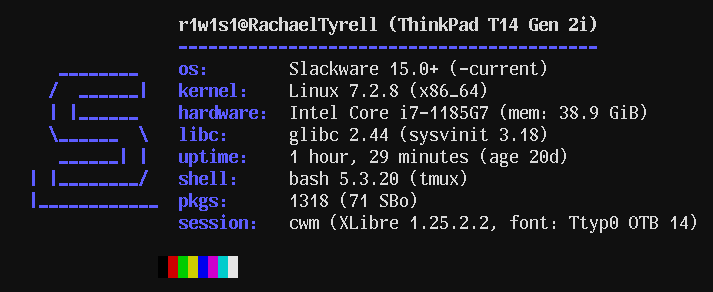
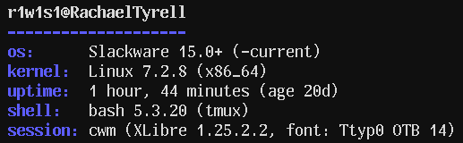

# slackfetch

`slackfetch` is a minimal system information utility focused on Slackware.
It is a small POSIX shell script that reports only information that can be
determined reliably.



## Features

- Slackware version and `-current` detection
- Kernel, architecture, CPU and memory information
- libc and sysvinit versions
- Installed Slackware, SBo, unofficial and Flatpak package counts
- Desktop environment, window manager, and session detection
- X11/XLibre and Wayland information
- Machine model detection with manual override support
- POSIX shell implementation with no runtime dependencies
- `NO_COLOR` support
- Minimal output mode with `-m`

## Installation

Install locally:

```sh
make
make install PREFIX="$HOME/.local"
```

Install system-wide:

```sh
make
sudo make install
```

## Usage

```sh
slackfetch
slackfetch -m
NO_COLOR=1 slackfetch
```

Minimal output:



## Overrides

Non-EWMH window managers can be specified manually:

```sh
SLACKFETCH_WM="dwm 6.8" slackfetch
```

The displayed machine model can be overridden when hardware detection is
incomplete or inaccurate:

```sh
SLACKFETCH_MODEL="QEMU" slackfetch
```

The displayed font can be overridden when automatic font information is not
available or when a different value should be shown:

```sh
SLACKFETCH_FONT="Ttyp0 OTB 14" slackfetch
```

The output uses a `session:` field for the active context. It reports the
window manager and display server in X11, the local virtual console and its
configured `/etc/default/rc.font` value, and the SSH terminal
when running remotely. SSH does not transmit the client's display font, so
the remote system's console font is not reported as the client's font.

## Documentation

The complete manual is available in [`slackfetch.1`](slackfetch.1):

```sh
man ./slackfetch.1
```

## Versioning

This project follows [Semantic Versioning 2.0.0](https://semver.org/).
Release tags use the `MAJOR.MINOR.PATCH` format.

## License

This project follows the same BSD license terms as the original `ufetch`
project. See [`LICENSE`](LICENSE).
